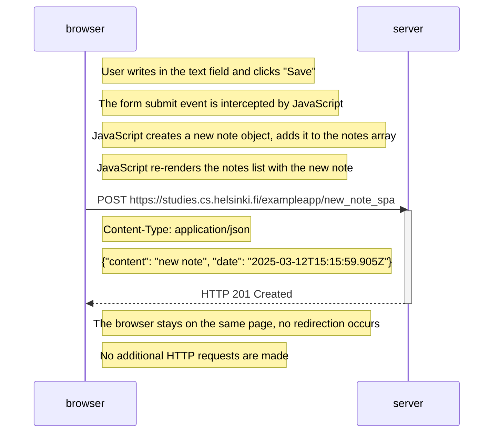

```mermaid
sequenceDiagram
    participant browser
    participant server

    Note right of browser: User writes in the text field and clicks "Save"
    Note right of browser: The form submit event is intercepted by JavaScript

    Note right of browser: JavaScript creates a new note object, adds it to the notes array
    Note right of browser: JavaScript re-renders the notes list with the new note
    
    browser->>server: POST https://studies.cs.helsinki.fi/exampleapp/new_note_spa
    activate server
    Note right of browser: Content-Type: application/json
    Note right of browser: {"content": "new note", "date": "2025-03-12T15:15:59.905Z"}
    server-->>browser: HTTP 201 Created
    deactivate server

    Note right of browser: The browser stays on the same page, no redirection occurs
    Note right of browser: No additional HTTP requests are made
```
